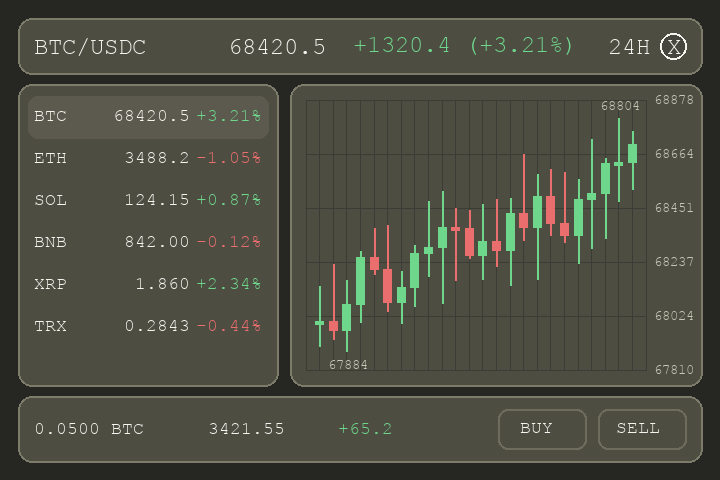

# 需求文档（PRD）

## 0. 文档信息
- 项目/功能名称：基于掌机的加密货币交易应用
- 作者：加戈
- 日期：2025-01-08
- 相关链接（原型/竞品/Issue）：https://app.hyperliquid.xyz/trade
- 类似产品参考：大富翁4的股票系统

## 1. 需求一句话概述
- 要做什么：开发基于掌机的加密货币交易应用
- 目标用户：加密货币交易用户
- 核心价值：提供安全、便捷的加密货币交易体验

## 2. 背景与动机
- 背景：任何人都可以开发任意前端，连接到hyperliquid后端
- 当前问题：网页上使用hyperliquid经常弹出钱包签名，体验不佳
- 为什么现在做：还没有人在掌机上做应用，现在可以尝试一下

## 3. 目标与非目标
### 3.1 目标（Goals）
- G1：集成了以太坊钱包功能，可以创建钱包，导入和导出私钥，签名交易，查看钱包地址和hyperliquid账户
- G2：钱包充值到hyperliquid账户，hyperliquid账户提现到钱包
- G3：集成了hyperliquid的价格查询，实时更新当前价格、24小时的涨跌、简单的价格走势图
- G4：集成了hyperliquid的现货交易功能，可以市价买入、市价卖出、查询持仓、统计持仓的价值
- G5：集成了hyperliquid的合约交易功能，可以做空、做多、平仓、查询成本价、清算价、当前仓位的盈利和亏损

### 3.2 非目标（Non-Goals）
- NG1：实时更新的简单K线图，通过按键切换1小时线、4小时线、日线、周线

## 4. 使用场景（User Stories）
- 场景 1：作为掌机用户，我想要把应用复制到掌机的SD卡，就能在掌机上运行，不需要安装额外依赖
- 场景 2：私钥保存在SD卡，确保掌机的其他程序无法访问私钥，如果用户把SD卡插入电脑，可以访问私钥
- 场景 3：有个熄屏但不休眠的模式，让掌机可以长时间省电运行

## 5. 流程
### 5.1 主流程（Happy Path）
- Step 1：如果SD卡里没有私钥，提示用户创建一个新钱包，如果SD卡里有私钥，就导入私钥

## 6. UI
### 6.1 通用按钮
- 按钮正常：只有文字，非粗体，没有背景没有框
- 按钮选中：即hover，按钮有背景色，文字粗体
- 按钮按下：即pressed，背景色变深，文字粗体
- 按钮弹起：即released，回到hover状态
- 按钮禁用：文字变灰，非粗体，没有背景没有框

### 6.2 通用窗口
- 对话框：通常有确定和取消两个按钮，按钮可以自定义数量和文字，用左右键选择，用A键确认，B键关闭对话框
- 提示框：只有一个按钮的对话框，按钮文字可以自定义，用A键确认，B键关闭对话框
- 菜单框：上下键选择，用A键确认，B键回到上级菜单

### 6.3 通用列表
- 列表项：没有背景没有框
- 列表项选中：列表项有背景色
- 列表项禁用：文字变灰，没有背景没有框

### 6.4 关键决策（已确认）
- 私钥存储：SD卡明文（相对路径存放在运行目录下）
- 钱包形态：只私钥单账户
- 下单确认：免二次确认，数量输入框中按下ENTER即直接下单
- Spot焦点：两级焦点（行 + buy/sell）
- 数值规则：支持小数；最大8位有效数字；超长小数截断；不使用科学计数法
- Spot资金来源：使用HL账户余额（Assets负责Wallet↔HL充值提现）
- Assets：同时展示Wallet与HL余额，用于充值/提现

### 6.5 数值显示规则
- 不使用科学计数法
- 最大8位有效数字；超出部分直接截断
- value：value = price * balance；小数点后2位（超出截断）
 - 极小值显示：如果数值过小导致无法在上述规则下表达，则显示为0（value显示为0.00）

### 6.6 现货交易（Spot）

#### 语言
- UI 文本：全部使用英文

#### 顶部栏（Header）
- 字体比正文更大，垂直居中
- 从左到右依次为：
  - Pair（交易对，左对齐）
  - Price（价格）
  - Change（涨跌量/百分比；涨绿跌红）
  - 24H（右对齐）
  - 最右侧一个圆形 X 按钮（表示按下 X 键）
- Price 与 Change 的整体位置向左靠一点（比 v3 更靠近 Pair）
- X 按钮：实心；不显示边框；按钮内的 X 字符更小；右对齐的间隔与左对齐间隔一致
- X 按钮：保持圆形样式（与 v4 一致）；背景色与文字颜色与底部 Buy 的 hover 状态保持一致；尺寸比 v4 放大一点点

#### 周期切换（X 键）
- 按下 X 循环切换周期：24H -> 4H -> 1H -> 24H
- 周期切换后需要联动更新：
  - Change（涨跌量/百分比）
  - K线图（Candlestick chart）

#### 中部布局
- 左侧：交易对列表（不显示滚动条）
  - 每一行从左到右：symbol、price + change%
  - change% 颜色：涨绿跌红
  - 左右内边距一致
  - price 在价格文本框内右对齐
  - symbol 字号更大
  - 两侧文字向中间靠一点，左右留出一致的间隔
- 右侧：K线图
  - 使用股票 K 线（蜡烛图），不要柱状图
  - K 线颜色：涨绿跌红
  - 背景：细暗线格子（网格）
  - 每条水平网格线的右侧标注该水平线对应的价格
  - K线最高点与最低点位置标注价格
  - 竖向网格线数量与 v4 一致（更少），让单个格子接近正方形
  - K线柱数量与 v3 一致（更密）；允许出现“蜡烛背后没有竖向网格线”的情况
  - K线不超出网格：最高点/最低点标注与K线本体都在网格内
  - 不在网格的最左/最右边界线上绘制K线（左右边界线处留空）
  - 最高点与最低点在网格上下边界处留出间隔（不要贴边）

#### 底部栏
- 字体与顶部栏一致，垂直居中
- 从左到右依次为：
  - 持有量（仅数值，例如：0.0500 BTC）
  - 价值（仅数值，带 $ 符号）
  - PnL（当前周期 24H/4H/1H 的盈亏数量；涨绿跌红；仅数值，带 $ 符号）
  - Buy 按钮
  - Sell 按钮
- 默认 hover 在 Buy 上：Buy 使用 hover 样式（有背景色、文字粗体、无边框），Sell 为正常态（只有文字、非粗体、无背景无边框），遵循 6.1 通用按钮规范

#### Spot交互补充
- 行焦点：上下键选择币种行
- 动作焦点：左右键在buy/sell之间切换
- A键：对当前buy/sell打开数量输入框
- B键：关闭数量输入框/退出动作焦点

### 6.7 数量输入
- 支持小数输入
- BUY最大值：HL账户的USDC余额 / price
- SELL最大值：HL账户中该币种可卖余额
- L1和R1可以快速根据最大值的百分比输入，按5%递减递增，比如最大值是100，输入框里是12，按下L1，输入框变成10，再按L1，变成5；如果输入框里是12，按下R1，输入框变成15，再按R1，变成20，以此类推，范围0%到100%
- 如果输入的数字大于最大值，数字变红
- DEL删除最后一位
- AC归零
- MAX输入最大值
- ENTER确认并直接下单，如果输入的数字大于最大值，弹出提示框，提示数字大于最大值

### 6.8 资产（Assets）
- 同时展示Wallet与HL余额，用于充值/提现

### 6.9 私钥文件（临时约定）
- 相对路径：`./data/private_key.txt`
- 内容格式：单行hex私钥（可带或不带0x前缀）

## 7. 屏幕与布局（掌机 720×480）
- 分辨率：`720 × 480`
- 横/竖屏：横屏
- 安全区/边距（如有）：无
- 字体/可读性要求（如有）：3.4英寸屏幕，字体大一些，操作方便

### 7.1 UI参考
图片只是参考，优先操作的便利性，字体要大，使用NotoSansCJK-Regular字体即可，风格只要配色有点复古的感觉就行

## 8. 范围（Scope）
### 8.1 本期包含（In Scope）
- G1 G2 G4
- Long和Short面板用“功能开发中”提示