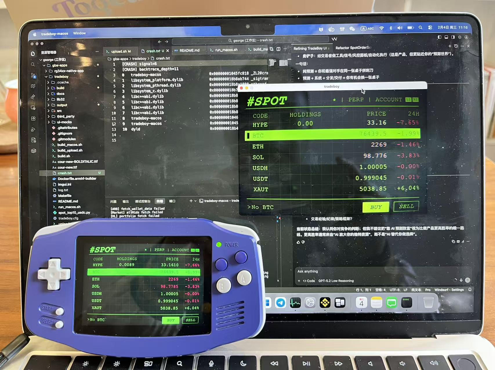

# TradeBoy

SDL2-based trading UI for the RG34XX handheld and macOS (Apple Silicon) desktop.



## Features
- SDL2 rendering + input
- OpenGL ES (RG34XX) and Desktop OpenGL (macOS)
- ImGui-based UI
- Hyperliquid integration (HTTP + WS)

## Tech stack
- C++11
- SDL2
- OpenGL ES 2.0 (RG34XX), Desktop OpenGL (macOS)
- Dear ImGui
- OpenSSL (ECDSA signing + websocket via openssl s_client)
- Docker (ARMHF cross-compile)

## Dependencies

### macOS (Apple Silicon)
- Homebrew
- SDL2 (`sdl2-config`)
- OpenSSL (via Homebrew)
- pkg-config
- curl (Homebrew; avoids LibreSSL TLS issues)

Install:
```
brew install sdl2 openssl@3 pkg-config curl
```

### RG34XX (ARMHF)
- Docker
- `rg34xx-armhf-builder` image (built by `make armhf-builder-image`)

## Build & run

### macOS (Apple Silicon)
Build:
```
./build_macos.sh
```

Run:
```
./run_macos.sh
```

### RG34XX (ARMHF)
Build:
```
make armhf-builder-image
make tradeboy-armhf-docker
```

Upload to device (uses SSH in `upload.sh`):
```
./upload.sh
```

## Fonts

TradeBoy reads `regular_font_path` and `bolditalic_font_path` from `tradeboy.cfg`.

- On first launch, it detects a system font and writes it to both paths.
- If the configured font fails to load (existing cfg only), TradeBoy falls back
  to a system font and shows an alert like: `Configured font 'X' failed to load. Using 'Y'.`.
- `upload.sh` does not upload font files. Place the font on the device yourself
  and update `tradeboy.cfg` if you want a custom typeface.

## Input mapping

### macOS keyboard (desktop build only)
- A -> RG34XX A
- B -> RG34XX B
- X -> RG34XX X
- Y -> RG34XX Y
- L -> RG34XX L1
- R -> RG34XX R1
- Q -> RG34XX L2
- W -> RG34XX R2

### RG34XX gamepad
- SDL joystick buttons are mapped in `src/app/Input.cpp`
- D-pad and hat switch supported
